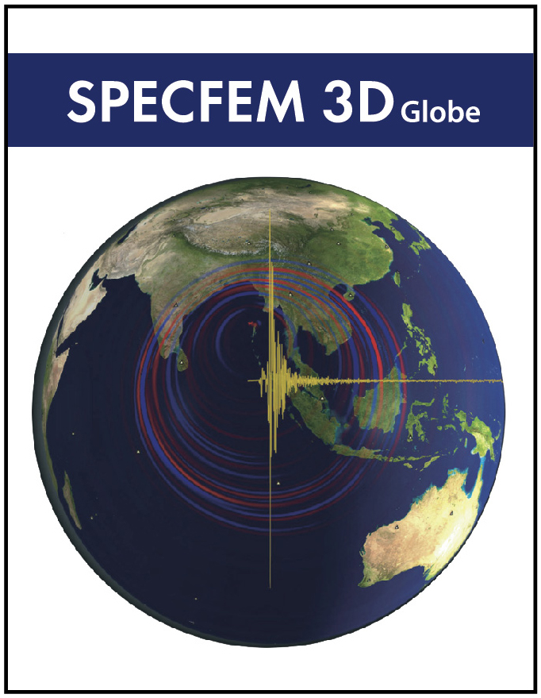

### Table of Contents
1. [Overview](/index.md)
2. [Introduction](/intro_specfem.md)
3. [Part I: Setting up SPECFEM3D_GLOBE](/setup_specfem3d.md)
4. [Part II: Continental-scale Simulations](/prepare_data.md)
5. [Part III: Visualization](/vis_seismo.md)
6. [Part IV: Adjoint Simulations (Bonus)](/run_adj_solver.md)
7. [Further Work](/further_work.md)
8. [Resources](/resources.md)

## Introduction

### SPECFEM3D_GLOBE 

The software package SPECFEM3D_GLOBE simulates three-dimensional global and
regional seismic wave propagation and performs full waveform imaging (FWI) or
adjoint tomography based upon the spectral-element method (SEM). 

It has very good accuracy and convergence properties. The spectral element
approach admits spectral rates of convergence and allows exploiting
(hp)-convergence schemes. It is also very well suited to parallel
implementation on very large supercomputers as well as on clusters of GPU
accelerating graphics cards.

Effects due to lateral variations in compressional-wave speed, shear-wave
speed, density, a 3D crustal model, ellipticity, topography and bathymetry, the
oceans, rotation, and self-gravitation are included. The package can
accommodate full 21-parameter anisotropy as well as lateral variations in attenuation.
Adjoint capabilities and finite-frequency kernel simulations are also included.

  

More information about the software package can be found in the SPECFEM3D_GLOBE
manual:

* [PDF version](https://geodynamics.org/cig/software/specfem3d_globe/specfem3d_globe-manual.pdf)
* [HTML version](http://specfem3d-globe.readthedocs.io/en/latest/)

### South Napa Earthquake 

The 2014 South Napa earthquake occurred in the North San Francisco Bay Area on
August 24 at 03:20:44 Pacific Daylight Time. At 6.0 on the moment magnitude
scale and with a maximum Mercalli intensity of VIII (Severe) the event was the
largest in the San Francisco Bay Area since the 1989 Loma Prieta earthquake. It
was located to the south of Napa and to the northwest of American Canyon on the
West Napa Fault. Total damage in the southern Napa Valley and Vallejo areas was
in the range of $362 million to 1 billion, with one person killed and 200
injured. Other aspects of the event included an experimental earthquake warning
system that alerted seismologists several seconds before the damaging shear
waves arrived, temporary changes in springs and wells, and the potential for
postseismic fault creep.

A summary of the tectonic setting is provided by the USGS at the following 
[link](https://earthquake.usgs.gov/archive/product/poster/20140824/us/1480721358422/poster.pdf).

<figure>
  <video src="Fig/orange.mp4" controls preload></video>
  <figcaption>Visualization of the South Napa earthquake produced by the <a
  href="http://global.shakemovie.princeton.edu/home.jsp">Global
  ShakeMovie project</a>.</figcaption>
</figure>

---

[Previous section](/index.md) -- [Next section](/setup_specfem3d.md)
