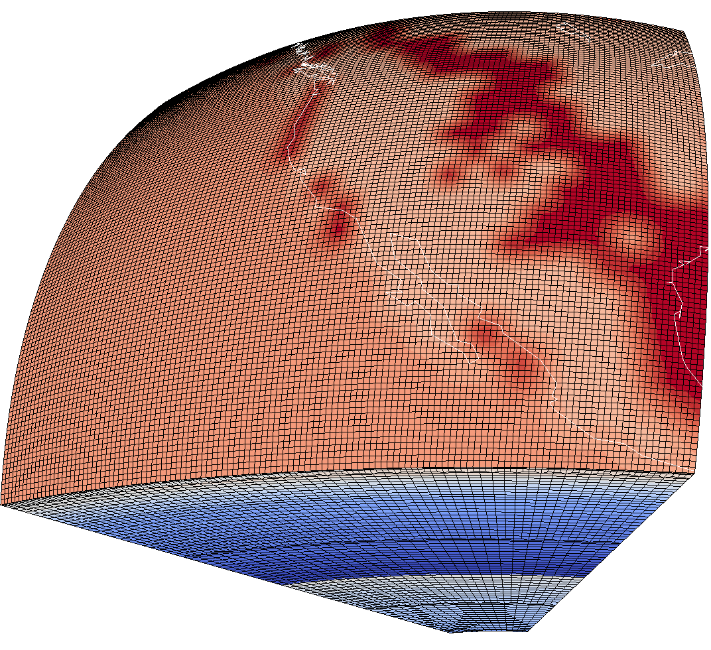

### Table of Contents
1. [Overview](/index.md)
2. [Introduction](/intro_specfem.md)
3. [Part I: Setting up SPECFEM3D_GLOBE](/setup_specfem3d.md)
4. [Part II: Continental-scale Simulations](/prepare_data.md)
5. [Part III: Visualization](/vis_seismo.md)
    1. [Visualize Seismograms](/vis_seismo.md)
    2. [Visualize Model Mesh](/vis_mesh.md)
    3. [Visualize Surface Movie](/vis_movie.md)
6. [Part IV: Adjoint Simulations (Bonus)](/run_adj_solver.md)
7. [Further Work](/further_work.md)
8. [Resources](/resources.md)


## Part III: Visualization

In this third part of the tutorial, we will look at methods for visualizing the
output simulation data. We will look at the following categories:

* Visualize Seismograms
* <mark>Visualize Model Mesh</mark>
* Visualize Surface Movie

### Visualize Model Mesh

In order to visualize the model mesh, we need to modify the `Par_file` such
that the mesh data are being saved. Therefore, open up `DATA/Par_file` and set
the following parameter to `.true.`:

      ...

      # save mesh files to check the mesh
      SAVE_MESH_FILES                 = .true.

      ...

Once we have updated this parameter, we need to go through the following three
steps in order to visualize the model mesh:

1. Rerun the mesh routine
2. Combine the output mesh data
3. Visualize using Paraview

* **Step 1: Rerun the mesh routine**
  
  This step is identical to what we did in Part II. We run the `xmeshfem3D`
  executable on the cluster by submitting the `submit_mesher` script:

```shell
      sbatch submit_mesher
```
  And use `squeue` to monitor the job. Once the job finishes, we can check the
  `OUTPUT_FILES/output_mesher.txt` file to make sure that the mesher ran
  successfully, and then we can move on to the next step.

* **Step 2: Combine the output mesh data**

  Once we have rerun the mesh routine with the `SAVE_MESH_FILES` parameter set
  to `true`, the mesh files will be output to the `DATABASES_MPI/` folder. The
  data is partitioned among the processees, and we will want to combine these
  data into single files.

  We can achieve this by running the `combine_data.py` script that is located
  in the root folder. This script will generate `VTK` files for the `vp` and
  `vs` model velocities which will be stored in the `OUPUT_FILES/` folder.

  **NOTE:** Under the hood, the `combine_data.py` script is running the
  `xcombine_vol_data_vtk` executable that is located in the
  `./specfem3d_globe/bin/` folder. For details on how to run this executable
  directly, inspect the `combine_data.py` script and consult the
  [SPECFEM3D_GLOBE manual](https://specfem3d-globe.readthedocs.io/en/latest/10_graphics/?highlight=xcombine_vol_data).

* **Step 3: Visualize using Paraview**

  Start `Paraview`, click the `Open` button in the top left corner, and navigate
  to the `./specfem3d_globe/OUTPUT_FILES/` folder. In this folder you should
  see two file-bundles called `reg_.._vp.vtk` and `reg_.._vs.vtk`, which are
  the combined data files that we produced in the previous step. In order to
  visualize the `vp` velocity model, click the pluss sign next to the 
  `reg_.._vp.vtk` bundle, select all the files in the bundle by holding down
  shift, and then click `OK`.

  Now that we have loaded the model, click `Apply` on the left-hand side in the
  `Properties` menu, and the model will appear.

  In order to see the model mesh, select the three model files in the
  `Pipeline-Browser` by holding down shift. Then go to the top menu and select
  `Filter -> Common -> Group Datasets`, and click `Apply` in the `Properties`
  menu. With `GroupDatasets1` selected in the `Pipeline-Browser` go to the
  drop-down menu which says `Surface` and select `Surface With Edges`.

  The procedure is similar for visualizing the `vs` velocity model.

<figure>
  
  <figcaption>Visualization of the model mesh with the vp component.</figcaption>
</figure>


---
In this section, we have looked at how to visualize the model mesh with different
components (e.g. vp, vs).

In the next section, we will look at how to create a surface movie for the
simulation data.

[Previous section](/vis_seismo.md) -- [Next section](/vis_movie.md)
