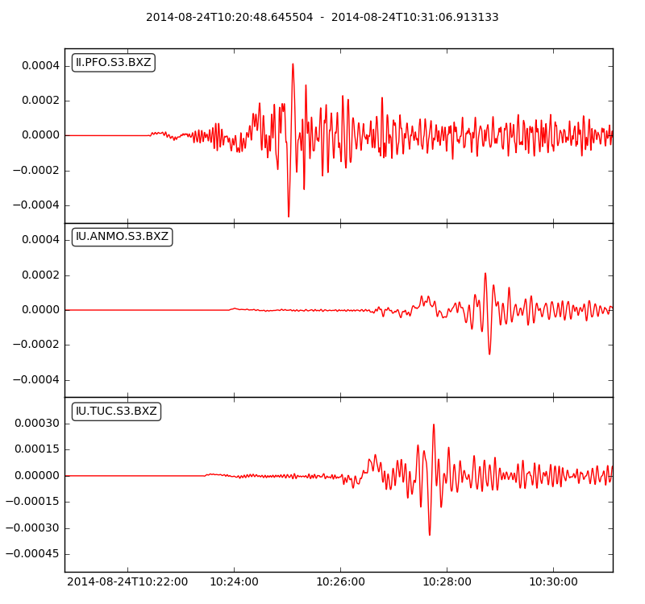

### Table of Contents
1. [Overview](/index.md)
2. [Introduction](/intro_specfem.md)
3. [Part I: Setting up SPECFEM3D_GLOBE](/setup_specfem3d.md)
4. [Part II: Continental-scale Simulations](/prepare_data.md)
5. [Part III: Visualization](/vis_seismo.md)
    1. [Visualize Seismograms](/vis_seismo.md)
    2. [Visualize Model Mesh](/vis_mesh.md)
    3. [Visualize Movie](/vis_movie.md)
6. [Part IV: Adjoint Simulations (Bonus)](/index.md)
7. [Resources](resources.md)


## Part III: Visualization

In this third part of the tutorial, we will look at methods for visualizing the
output simulation data. We will look at the following categories:

* <mark>Visualize Seismograms</mark>
* Visualize Model Mesh
* Visualize Movie

### Visualize Seismograms

The output seismograms can be found in the `OUTPUT_FILES/` folder. In order to
visualize the seismograms, we will use the `plotseis.py` script that is located
in the root folder.

This script takes the names of the seismograms we want to visualize as command
line input, and uses ObsPy under the hood to generate the plots. The usage is
as follows:

```shell
      python3 plotseis.py [seismogram_file_names]
```

For example, if we want to visualize the seismograms `SEIS1.MXZ.sem.sac` and
`SEIS2.MXZ.sem.sac`, we would type

```shell
      python3 plotseis.py ./OUTPUT_FILES/SEIS1.MXZ.sem.sac ./OUTPUT_FILES/SEIS2.MXZ.sem.sac
```

Which will give us the following plot:

<p align="center">
  
</p>

---
In this section, we have looked at how to provide the input data that is
necessary to run a continental-scale simulation with SPECFEM3D_GLOBE.

In the next section, we will look at how to generate a mesh for the
continental-scale model.

[Previous section](/run_solver.md) -- [Next section](/vis_mesh.md)
